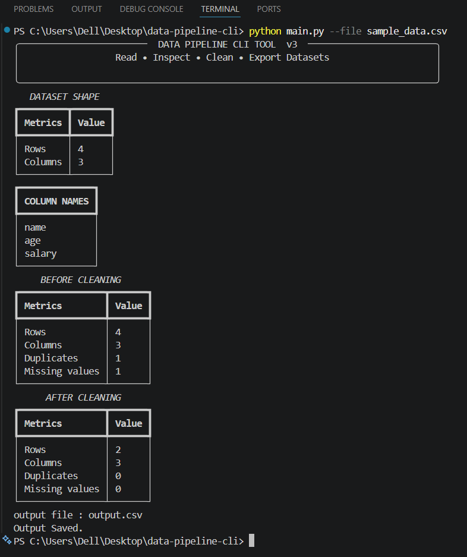
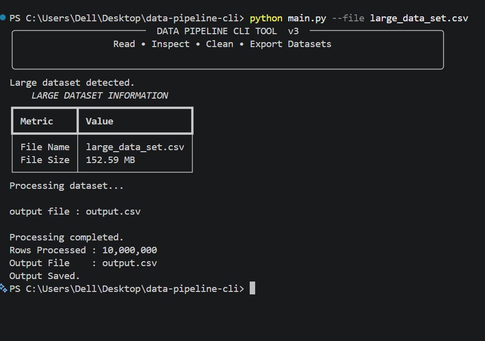
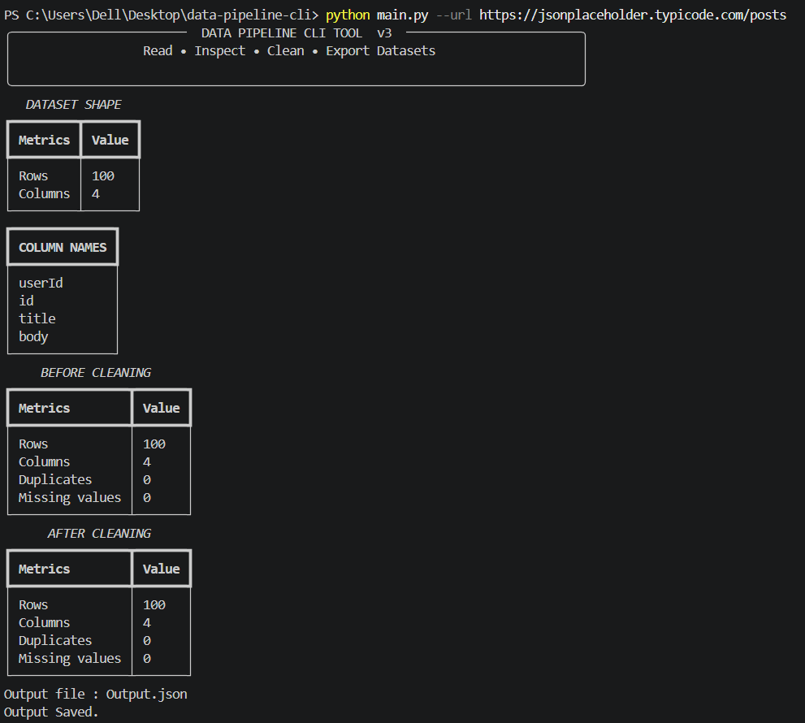

# Data Pipeline CLI Tool

A command-line tool for loading, inspecting, cleaning, and exporting structured datasets from local files and REST APIs.

## Overview

Real-world datasets are often messy, inconsistent, and originate from multiple sources. Preparing these datasets manually is repetitive and time-consuming.

This project automates common data preparation tasks including loading, inspecting, cleaning, and exporting datasets while providing a clean command-line interface and formatted terminal reports.

## Features

- Load CSV files
- Load JSON files
- Load Excel (.xlsx) files
- Load data directly from REST APIs
- Automatically flatten nested JSON responses
- Efficient chunked processing for large CSV datasets
- Inspect dataset structure
- Configurable duplicate handling (`remove` / `keep`)
- Configurable missing value handling (`drop` / `keep` / `mean` / `median` / `mode`)
- Rich terminal reports
- Export cleaned datasets
- Modular project architecture
- Command-line interface using `argparse`

## Supported Input Sources

### Local Files

- CSV (.csv)
- JSON (.json)
- Excel (.xlsx)

### REST APIs

Example:

```bash
python main.py --url https://jsonplaceholder.typicode.com/users
```

## Supported Output Formats

| Input | Output |
|--------|---------|
| CSV | output.csv |
| JSON | output.json |
| Excel | output.xlsx |
| REST API | output.json |

## Project Structure

```text
data-pipeline-cli/

├── main.py
├── loader.py
├── cleaner.py
├── display.py
├── export.py
├
│
├── sample_data.csv
├── sample_data.json
├── sample_data.xlsx
|
│
├── screenshots/
│   ├── small-dataset.png
│   ├── large-dataset.png
│   └── api-processing.png
│
├── requirements.txt
├── README.md
└── .gitignore
```

## Modules

| Module | Responsibility |
|---------|----------------|
| **main.py** | Controls the complete pipeline workflow |
| **loader.py** | Loads data from files and REST APIs |
| **cleaner.py** | Performs configurable data cleaning operations |
| **display.py** | Displays formatted Rich terminal reports |
| **export.py** | Exports cleaned datasets |

## Installation

```bash
git clone https://github.com/vasusharma001-hash/data-pipeline-cli-.git

cd data-pipeline-cli

pip install -r requirements.txt
```

## Usage

### CSV

```bash
python main.py --file sample_data.csv
```

### JSON

```bash
python main.py --file sample_data.json
```

### Excel

```bash
python main.py --file sample_data.xlsx
```

### REST API

```bash
python main.py --url https://jsonplaceholder.typicode.com/users
```

### Large Dataset

```bash
python main.py --file large_data_set.csv
```

Large CSV files are automatically processed using chunked loading to reduce memory usage.

# Screenshots

## Small Dataset Processing



Processes CSV, JSON, and Excel datasets by inspecting the dataset, removing duplicates, handling missing values, and exporting the cleaned output.

## Large Dataset Processing



Large CSV files (>100 MB) are automatically processed in chunks, allowing the tool to process datasets that do not fit entirely into memory.

## REST API Processing



Load data directly from REST APIs, automatically flatten nested JSON responses, inspect the dataset, apply cleaning strategies, and export the processed output.

## Cleaning Strategies

### Duplicate Handling

Supported strategies:

- `remove` *(default)*
- `keep`

Examples:

```bash
python main.py --file sample_data.csv --duplicates remove
```

```bash
python main.py --file sample_data.csv --duplicates keep
```

### Missing Value Handling

Supported strategies:

- `drop` *(default)*
- `keep`
- `mean`
- `median`
- `mode`

Examples:

```bash
python main.py --file sample_data.csv --missing mean
```

```bash
python main.py --file sample_data.csv --duplicates remove --missing mode
```

```bash
python main.py --file sample_data.csv --duplicates keep --missing keep
```

## Pipeline Workflow

```text
           CSV
          JSON
         Excel
           API
            │
            ▼
      Load Dataset
            │
            ▼
     Inspect Dataset
            │
            ▼
   Handle Duplicates
            │
            ▼
 Handle Missing Values
            │
            ▼
   Generate Report
            │
            ▼
    Export Dataset
```

## Cleaning Order

Cleaning operations are always executed in the following order:

1. Handle duplicate rows
2. Handle missing values
3. Export the cleaned dataset

**Note**

Statistical strategies (`mean`, `median`, and `mode`) are applied **after duplicate handling**.

Therefore, calculated values may differ depending on whether duplicate rows are removed or kept.

## Large Dataset Processing

CSV files larger than **100 MB** are automatically processed in chunks.

Instead of loading the entire dataset into memory, the file is read and processed chunk-by-chunk.

### Benefits

- Reduced memory usage
- Ability to process datasets larger than available RAM
- Scalable processing for very large CSV files

## Current Limitations

### Chunk Processing

Duplicate detection is performed **within individual chunks only**.

If duplicate rows exist across different chunks, they will **not** be detected or removed.

Example:

Chunk 1

```text
ID  Name
1   Alice
2   Bob
```

Chunk 2

```text
ID  Name
2   Bob
3   Charlie
```

The duplicate row exists across two chunks, so it will remain in the exported dataset.

This design prioritizes low memory usage and scalability over global duplicate detection. Detecting duplicates across chunks would require additional state management or a different processing strategy.

### API Support

The current implementation expects REST APIs that return JSON responses.

Nested JSON structures are flattened automatically using `pandas.json_normalize()`.

## Sample Datasets

The repository includes sample datasets for testing:

- sample_data.csv
- sample_data.json
- sample_data.xlsx
- large_data_set.csv

## Current Version

**Version 3.0**

## Roadmap

### Version 4

- Database support (MySQL/PostgreSQL)
- Global duplicate detection across chunks
- Multiple file processing
- Data validation
- Logging system

### Future Improvements

- Parallel chunk processing
- YAML / JSON configuration
- Additional cleaning strategies
- Unit tests
- Performance benchmarking

## Technologies Used

- Python
- Pandas
- Rich
- Requests
- Argparse
- OpenPyXL

## License

This project is intended for learning and educational purposes.
